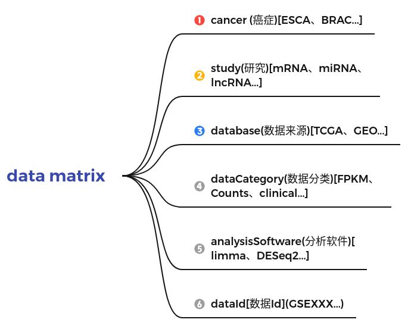

## 生物信息资源管理
#### 技术
+ SpringBoot
+ mysql

#### 功能
+ 项目报告管理
+ 癌症数据资源管理

#### 设计
+ data matrix
    + cancer (癌症)[ESCA、BRAC...]
    + study(研究)[mRNA、miRNA、lncRNA...]
    + dataOrigin(数据来源)[TCGA、GEO...]
    + dataCategory(数据分类)[FPKM、Counts、clinical...]
    + analysisSoftware(分析软件)[limma、DESeq2...]
    + dataId[数据Id](GSEXXX...)
    


#### 测试
+ <https://bioinfofungi.gitee.io/bioinfo_web_ui/>
+ <http://git.bioinfofungi.com/>

前台配置Local Storage
```
url_port:{"url":"localhost","port":"8080"}
```
### 数据初始化
```
http://localhost:8080/api/cancer/init?authorize=XXXXXX&path=/home/wangyang/Downloads/TCGADOWNLOAD/Cancer.tsv
http://localhost:8080/api/study/init?authorize=XXXXXX&path=/home/wangyang/Downloads/TCGADOWNLOAD/Study.tsv
http://localhost:8080/api/data_origin/init?authorize=XXXXXX&path=/home/wangyang/Downloads/TCGADOWNLOAD/DataOrigin.tsv
http://localhost:8080/api/data_category/init?authorize=XXXXXX&path=/home/wangyang/Downloads/TCGADOWNLOAD/DataCategory.tsv
http://localhost:8080/api/analysis_software/init?authorize=XXXXXX&path=/home/wangyang/Downloads/TCGADOWNLOAD/AnalysisSoftware.tsv

http://localhost:8080/api/cancer_study/init?authorize=XXXXXX&path=/home/wangyang/Downloads/TCGADOWNLOAD/CancerStudy.tsv
```

```
http://localhost:8080/api/data_import/init?authorize=XXXXXX&path=/home/wangyang/Downloads/TCGADOWNLOAD
```

+ <http://localhost:8080/h2-console>

#### 联系
+ Email: 1749748955@qq.com
+ Email: 3300297450@qq.com

#### 代码贡献
```
git clone https://github.com/BioinfoFungi/bioinfo_analysis.git
```
#### 迁移后提交
+ 方法有三种
    + 修改命令:git remote origin set-url [url]
    + 先删后加
        + git remote rm origin
        + git remote add origin [url]
    + 直接修改config文件
```
git remote add origin_1 https://github.com/BioinfoFungi/bioinfo_analysis.git
git add .
git commit -m 'XXXX'
git status
git push origin_1 master
```

## 参考
+ <https://blog.csdn.net/weixin_45824805/article/details/108732251>
+ <https://jtablesaw.github.io/tablesaw/>
+ <https://blog.csdn.net/weixin_37595711/article/details/85137760>
+ <https://jtablesaw.github.io/tablesaw/userguide/toc>
+ [Spring boot缓存](https://blog.csdn.net/rubulai/article/details/85015074/)